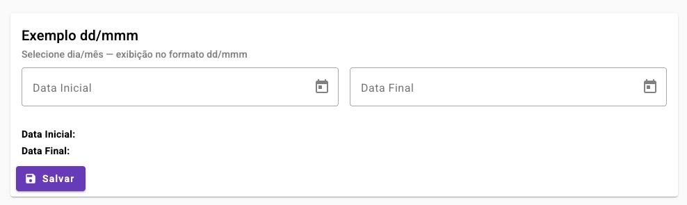

# 📅 Angular Datepicker - Formato dd/mmm

Este projeto é um exemplo em **Angular 18** com **Angular Material**,
demonstrando como criar uma tela com **dois campos de data**
(`Data Inicial` e `Data Final`) onde o usuário escolhe a data
normalmente, mas o input exibe apenas **dia/mês no formato `dd/mmm`**
(exemplo: `15/jan`).

------------------------------------------------------------------------

## 🚀 Tecnologias utilizadas

-   Angular 18 (standalone components + Vite)
-   Angular Material (Datepicker, Card, FormField, Inputs, Buttons,
    Icons)
-   SCSS
-   Custom `DateAdapter` para parse/format de datas

------------------------------------------------------------------------

## ⚙️ Funcionalidades

-   Seleção de **Data Inicial** e **Data Final** via Datepicker
    Material.
-   Exibição no campo no formato **dd/mmm** (`11/ago`, `23/dez`).
-   Aceita entrada manual tanto em:
    -   `dd/mmm` → ex.: `15/jan`, `05/fev`
    -   `dd/mm` → ex.: `15/01`, `05/02`
-   O ano é assumido como **ano atual**.
-   Botão **Salvar** que monta um payload no formato `dd/mmm` e exibe no
    console (simulando envio ao backend).
-   Layout com **MatCard** responsivo.

------------------------------------------------------------------------

## 📂 Estrutura do projeto

    src/
     ├── app/
     │    ├── shared/
     │    │     └── custom-date-adapter.ts   # DateAdapter customizado
     │    ├── app.component.ts               # Componente standalone principal
     │    ├── app.component.html             # Template com Datepickers
     │    └── app.component.scss             # Estilo da tela
     ├── index.html                          # Fonte Roboto + Material Icons
     └── styles.scss                         # Tema Angular Material / estilos globais

------------------------------------------------------------------------

## ▶️ Como executar

### Pré-requisitos

-   Node.js 20+
-   Angular CLI 18+

### Passos

1.  Clone o repositório:

    ``` bash
    git clone https://github.com/seu-usuario/angular-dd-mmm.git
    cd angular-dd-mmm
    ```

2.  Instale as dependências:

    ``` bash
    npm install
    ```

3.  Execute em modo desenvolvimento:

    ``` bash
    ng serve
    ```

    > A aplicação estará disponível em `http://localhost:4200/`

------------------------------------------------------------------------

## 🖼️ Tela de exemplo



------------------------------------------------------------------------

## 🔧 Ajustes adicionais

-   **Tema Angular Material**: o projeto utiliza `indigo-pink.css`. Caso
    queira criar um tema customizado, edite `styles.scss`.
-   **Validação**: é possível adicionar validação de intervalo (ex.:
    `Data Final >= Data Inicial`) via `FormGroup`.
-   **Máscara**: se quiser forçar input manual `dd/mmm`, pode usar
    `ngx-mask`.

------------------------------------------------------------------------

## 📜 Licença

Este projeto é apenas um exemplo de estudo. Livre para uso e
modificação.
